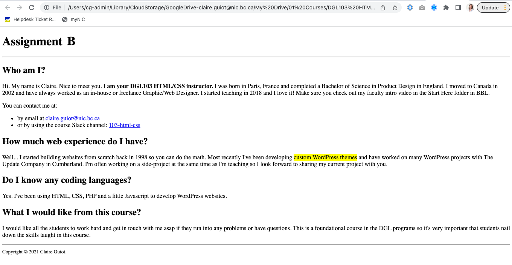

# Assignment B - HTML Elements
This is your remote assignment B repository readme file. You are seeing this file because you have successfully accepted the assignment link and GitHub automatically created a remote repository for you.
## Objectives
Create a simple web page that includes the various HTML elements to structure and format the content on the page. Below is an example of what your assignment could look like when finished:

## Instructions
Note: 
* Remember to look up how to do things in the Reference Guides.
* As you work, regularly save your files and check out what your web page looks like by opening index.html in a web browser: Right-click anywhere in the file > Open in Default Browser (you need to have the “open in browser” extension installed in VS Code for this to work).
* Also remember to make regular commits to save the history of your work, that way you will be able to backtrack to a previous commit if you’ve made an error and you wish to continue with a previous version of your files.
* Read through all the instructions below before you start the assignment.
### Step 1: Create the website structure
* Use GitHub Desktop to clone your remote Assignment B repository onto your local machine.
* In VS Code, add a file called index.html to your local Assignment B repository. 
* Open index.html and add the HTML skeleton code. (If the html5 pop-up menu doesn’t appear then you can copy and paste the skeleton code from the course Slack channel)
* Add a comment in the head section of the html code including: the course code, your section number, your student name, and the assignment letter. Example:
`<!-- DGL 103 DLU1 - Claire Guiot - Assignment B -->`
* Change the page title to assignment B.
### Step 2: Add the required content
Add the following content where you believe it belongs:
* Who you are with a short bio (include your github username instead of your full name if you are concerned about privacy)
* Your experience with the web
* Do you know any coding languages?
* Your expectations for this course (or what you would like to learn in the course)

Structure and format your content using the following HTML:
* Some semantic structural elements: header, main (or section) and footer. 
* One H1 tag
* Some H2 tags (include more levels of headings if appropriate)
* A few paragraphs
* A list (ordered or unordered)
* Three or more different inline-level text elements, ex: `<em>`. Use https://developer.mozilla.org/en-US/docs/Web/HTML/Element#inline_text_semantics or https://htmlreference.io/ to find some inline text elements to use.
* A hyperlink
* One or more HTML comment(s) that explain your code or highlight interesting things, for ex: `<!-- I used the mark text element to highlight the content -->`
## Step 3: Validate your work
1. Go to https://validator.w3.org/#validate_by_upload 
Choose your index.html file in your local repository and click the Check button. If there are no errors then you should see a green message that says “Document checking completed. No errors or warnings to show.” If you get an error message then troubleshoot your work until you get the green message.
Take a screenshot of your HTML validation results. 
2. Go to https://jigsaw.w3.org/css-validator/#validate_by_upload 
Choose your style.css file in your local repository and click the Check button.
If you get the green “Congratulations! No Error Found.” then take a screenshot of the screen. If not, troubleshoot your work.

## Step 4: Submit your work
Complete the following steps from the GitHub and GitHub Desktop Reference Guide:
1. Commit your changes if you’ve made changes since the last commit.
2. Push your changes to GitHub.
3. Submit your assignment in BrightSpace:
You can access the assignment submission tool by navigating to the week’s assignment in the Content Area, or by clicking on Assignments in the main menu. 
    * Click on "Assignment B Submission" and follow the provided instructions. 
* Don’t forget to answer the questions and attach the screenshots of your final W3 HTML and CSS validation results.
4. If you have been using a lab computer on campus to do your work with GitHub Desktop, remember to shutdown or restart the computer before you leave the room, so that other students won’t have access to your repositories.

## Deadlines
Assignments must be submitted before the end of the week but they will only be graded at the end of every unit. Late assignments will not be accepted and will receive an F. You can complete and submit a contract that allows you to extend the deadline for an assignment but you must email it to your instructor a minimum of 48 hrs before the deadline. Deadline extensions are only allowed for those unplanned, unexpected emergencies that life sometimes throws at us, and they will only be approved by your instructor if you follow the correct process. See the Course Info folder in BrightSpace for more info.